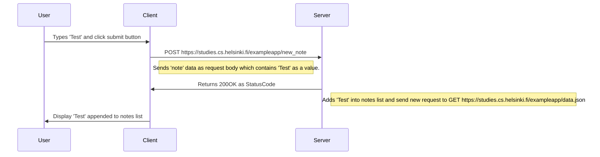

```mermaid
sequenceDiagram
    participant User
    participant Client
    participant Server

    User ->> Client: Types 'Test' and click submit button
    Client ->> Server: POST https://studies.cs.helsinki.fi/exampleapp/new_note
    note right of Client: Sends 'note' data as request body which contains 'Test' as a value.
    Server ->> Client: Returns 200OK as StatusCode
    note right of Server: Adds 'Test' into notes list and send new request to GET https://studies.cs.helsinki.fi/exampleapp/data.json
    Client ->> User: Display 'Test' appended to notes list
```