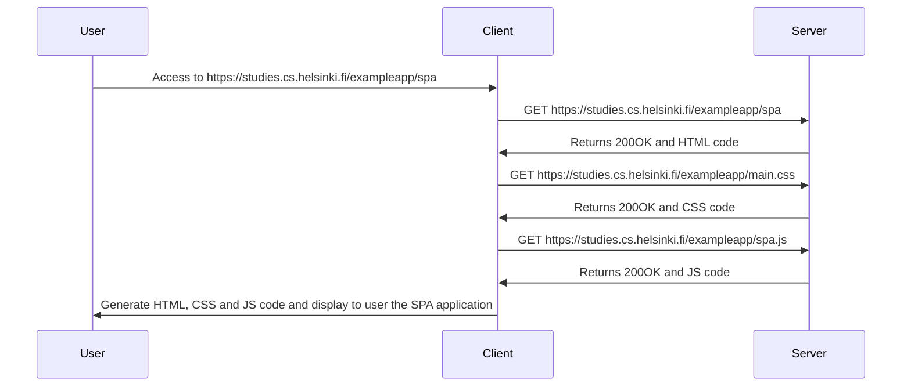

```mermaid
sequenceDiagram
    participant User
    participant Client
    participant Server

    User ->> Client: Access to https://studies.cs.helsinki.fi/exampleapp/spa
    Client ->> Server: GET https://studies.cs.helsinki.fi/exampleapp/spa
    Server ->> Client: Returns 200OK and HTML code
    Client ->> Server: GET https://studies.cs.helsinki.fi/exampleapp/main.css
    Server ->> Client: Returns 200OK and CSS code
    Client ->> Server: GET https://studies.cs.helsinki.fi/exampleapp/spa.js
    Server ->> Client: Returns 200OK and JS code
    Client ->> User: Generate HTML, CSS and JS code and display to user the SPA application
```