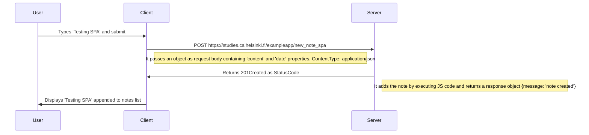

```mermaid
sequenceDiagram
    participant User
    participant Client
    participant Server

    User ->> Client: Types 'Testing SPA' and submit
    Client ->> Server: POST https://studies.cs.helsinki.fi/exampleapp/new_note_spa
    note right of Client: It passes an object as request body containing 'content' and 'date' properties.  ContentType: application/json
    Server ->> Client: Returns 201Created as StatusCode
    note right of Server: It adds the note by executing JS code and returns a response object {message: 'note created'}
    Client ->> User: Displays 'Testing SPA' appended to notes list
```